<!--
  README profil GitHub — Faresa Prasetyo Nugroho
  Simpan sebagai README.md di repo: github.com/Faresapn/Faresapn
  Simpan hero.svg di: assets/hero.svg
  Simpan snake.yml di: .github/workflows/snake.yml
-->

<div align="center">



<br>

[](https://git.io/typing-svg)


</div>


## `> whoami`

```jsonc
{
  "nama"        : "Faresa Prasetyo Nugroho",
  "peran"       : "AI Engineer / Software Developer",
  "lokasi"      : "Purbalingga, Jawa Tengah",
  "pengalaman"  : "3+ tahun di production",
  "spesialisasi": ["AI Agent Deployment", "Workflow Automation", "LLM Integration"],
  "andalan"     : ["n8n", "Python", "Kotlin", "Docker"],
  "kuliah"      : "S1 Informatika, Universitas Teknologi Yogyakarta (IPK 3.54)",
  "sekarang"    : "Membangun pipeline AI otonom end-to-end"
}
```

- Merancang **pipeline AI agent otonom** dengan n8n — dari webhook sampai output video, tanpa sentuhan manual
- Latar belakang **Android engineering** yang kuat (Kotlin, MVVM, Clean Architecture) di KlikDokter, Telkom Indonesia, dan Komerce
- Penelitian **AR e-commerce** terbit di jurnal JINTEKS
- Lagi mendalami **arsitektur multi-agent** dan sistem yang bisa mengambil keputusan sendiri


## `> stack --list`

<div align="center">

**AI &amp; Automation**


**Bahasa, Framework &amp; Tools**


<br>


</div>


## `> projects --featured`

<table>
<tr>
<td width="50%" valign="top">

### AI Content Automation Pipeline
`n8n` `Docker` `LLM API` `Google Drive API`

Pipeline AI agent yang sepenuhnya otonom: terima prompt teks, keluar video promosi hasil generate AI. Multi-step API orchestration dipicu lewat webhook, self-hosted di Docker dengan custom domain.

**Dampak:** effort konten manual turun ke nyaris nol.

<a href="https://github.com/Faresapn/Workflow-CI"></a>

</td>
<td width="50%" valign="top">

### OpenClaw AI Agent
`AI Agent` `Signal Detection` `Real-time Alert`

Agent monitoring harga real-time untuk BTC, ETH, SOL, dan BNB lintas platform trading. Punya workflow deteksi sinyal entry/exit berbasis indikator teknikal, plus modul manajemen jadwal harian.

**Dampak:** keputusan trading jadi berbasis data, bukan tebakan.

<a href="https://github.com/Faresapn/tradingview-mcp"></a>

</td>
</tr>
<tr>
<td width="50%" valign="top">

### E-Commerce AR Application
`Kotlin` `AR SDK` `MVVM` `Published`

Aplikasi AR yang bikin pembeli bisa melihat produk 3D di ruangan mereka sebelum checkout. Aku pimpin dari riset sampai rilis, divalidasi lewat blackbox dan whitebox testing.

**Publikasi:** Jurnal JINTEKS, 2024.

</td>
<td width="50%" valign="top">

### Android Production Apps
`Kotlin` `Clean Architecture` `Retrofit` `Coroutines`

Kumpulan aplikasi Android yang sudah jalan di production: sistem absensi, Point of Sale, agregator berita, dan sistem manajemen nelayan untuk Telkom Indonesia.

**Skala:** 5 perusahaan, puluhan fitur ter-merge.

<a href="https://github.com/Faresapn?tab=repositories"></a>

</td>
</tr>
</table>


## `> git stats --live`

<div align="center">


</div>

### Kontribusi

<div align="center">

<picture>
  <source media="(prefers-color-scheme: dark)" srcset="https://raw.githubusercontent.com/Faresapn/Faresapn/output/snake-dark.svg">
  <source media="(prefers-color-scheme: light)" srcset="https://raw.githubusercontent.com/Faresapn/Faresapn/output/snake.svg">
  
</picture>

</div>


<details>
<summary><b><code>&gt; career --timeline</code></b></summary>
<br>

```
2026  ●  AI Engineer — pipeline AI otonom, n8n, LLM integration
      │
2021  ●  Android & Web Developer — Freelance, Yogyakarta
 s.d. │     Android production + web company profile untuk klien
2026  │
      │
2021  ●  Android Developer — KlikDokter, Jakarta
      │     Migrasi 6-7 modul dari Java ke Kotlin Native
      │
2020  ●  Android Developer — Agree, Telkom Indonesia, Jakarta
      │     5 fitur production, RxJava & Coroutines di codebase enterprise
      │
2020  ●  Android Developer — Komerce, Purbalingga
      │     Sistem absensi karyawan dengan LiveData realtime
      │
2019  ●  Android Developer Intern — On Trucks, Jakarta
         Integrasi REST API dengan Retrofit
```

</details>

<details>
<summary><b><code>&gt; credentials --show</code></b></summary>
<br>

**Pendidikan**

S1 Informatika — Universitas Teknologi Yogyakarta (2021–2025) · IPK 3.54 / 4.00

**Sertifikasi Dicoding Indonesia**


**Penghargaan**

| Tahun | Capaian |
|---|---|
| 2021 | Juara 1 — ITC Bisnis TIK |
| 2021 | Juara 3 — SMK DIGISOCIALFEST 2020 |
| 2020 | Juara 3 — Permata Youthpreneur |
| 2019 | Finalis — Digital Construction Hackathon |

**Organisasi**

HIMATIKA — Universitas Teknologi Yogyakarta (2022–2023)

</details>


<div align="center">

## `> connect`

Terbuka untuk peran AI Engineer, kolaborasi riset, dan proyek automation.

<a href="mailto:faresaprasetyon@gmail.com"></a>
<a href="https://linkedin.com/in/faresaprasetyo/"></a>
<a href="https://github.com/Faresapn"></a>

</div>


